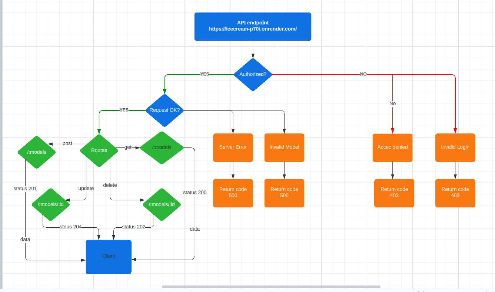

# Ice Cream  Api

## Created By Mohamad Abdin && Abdullah Aljoulani 

> In this project we created a small application for a Ice cream store to help manage user favorite flavores while giving the user the ablity to view ,create ,delete ,update and add a flavor to favorites.

## Security

>applications are usless without Security ,So in this application we used two middlewares to authinticate and authorize the users ,one to verfy user data ,and one to veryfy users token.

## To run this application Do the following

1-Clone this repo to your local device\
2-In the terminal open the directory where you saved it \
3-open it using **CODE .** \
4-Now Run **npm i** to install all the dependincies
5-then **run nodemon**

### UML

### DEPLOED LINK
<https://icecream-p70i.onrender.com/>

### PRS
<https://github.com/Armada6199/iceCream/pull/1>
<https://github.com/Armada6199/iceCream/pull/3>
<https://github.com/Armada6199/iceCream/pull/2>
